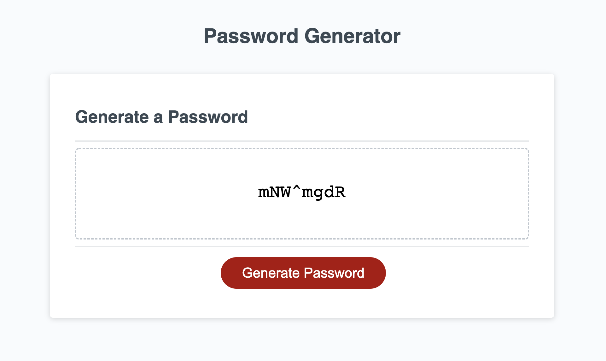

# Password Generator 

## Description 
This password generator app allows users to select the features that they want in a password: password length, uppercase, lower case, or numbers. After going through all the prompts, a unique password is generated and displayed to the page.

## Screenshot

## Link 
Check out the app on Github Pages: https://stephtf.github.io/password-generator/

## Questions 
If you have any questions about the repo, open an issue or contact me directly at stfajardo@gmail.com. You can find more of my work at [stephtf](https://github.com/stephtf/) or by visiting my website https://www.stephfajardo.com
